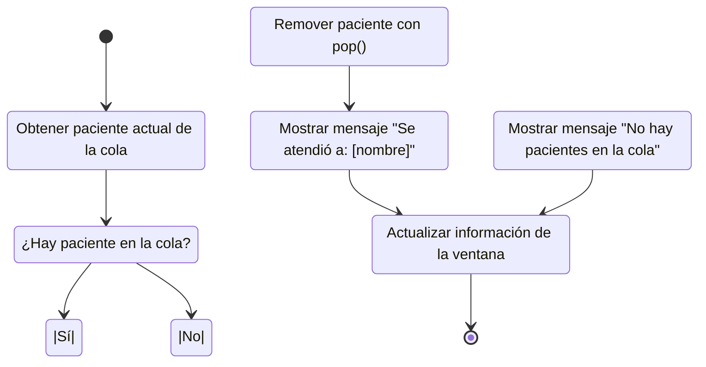

### Diagrama de Actividad del método `atender()` (Mermaid)

```mermaid
stateDiagram-v2
    [*] --> ObtenerPaciente
    ObtenerPaciente: Obtener paciente actual de la cola
    ObtenerPaciente --> TienePaciente
    TienePaciente: ¿Hay paciente en la cola?
    TienePaciente -->|Sí| RemoverPaciente
    RemoverPaciente: Remover paciente con pop()
    RemoverPaciente --> MensajeAtendido
    MensajeAtendido: Mostrar mensaje "Se atendió a: [nombre]"
    MensajeAtendido --> ActualizarVentana
    TienePaciente -->|No| MensajeNoHay
    MensajeNoHay: Mostrar mensaje "No hay pacientes en la cola"
    MensajeNoHay --> ActualizarVentana
    ActualizarVentana: Actualizar información de la ventana
    ActualizarVentana --> [*]
```
