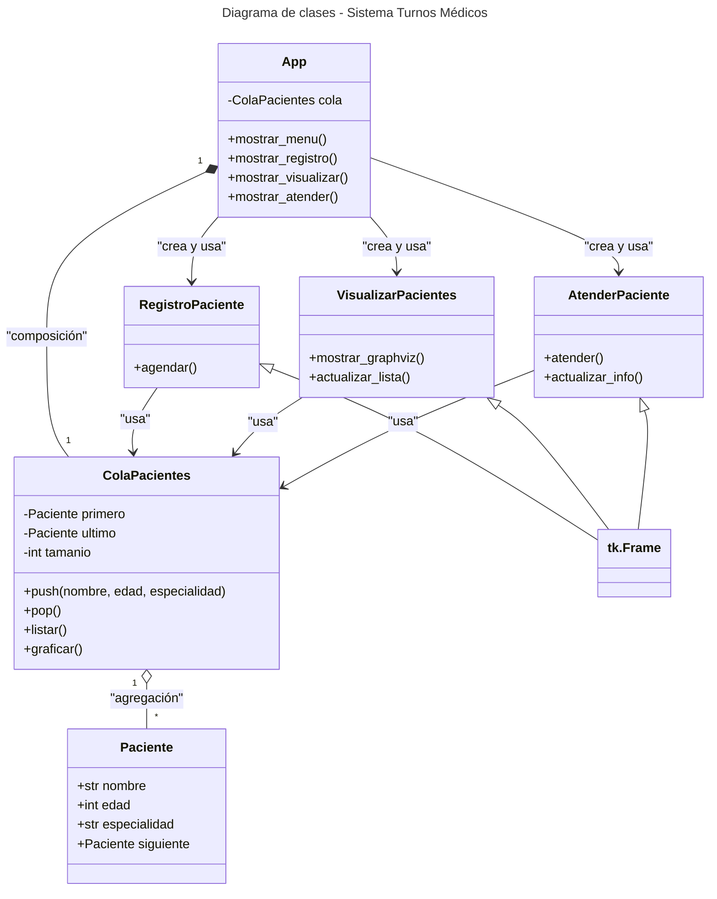

### Diagrama de Clases UML

```mermaid
---
title: Diagrama de clases - Sistema Turnos Médicos
---
classDiagram
    class Paciente {
        +str nombre
        +int edad
        +str especialidad
        +Paciente siguiente
    }
    class ColaPacientes {
        -Paciente primero
        -Paciente ultimo
        -int tamanio
        +push(nombre, edad, especialidad)
        +pop()
        +listar()
        +graficar()
    }
    class App {
        -ColaPacientes cola
        +mostrar_menu()
        +mostrar_registro()
        +mostrar_visualizar()
        +mostrar_atender()
    }
    class RegistroPaciente {
        +agendar()
    }
    class VisualizarPacientes {
        +mostrar_graphviz()
        +actualizar_lista()
    }
    class AtenderPaciente {
        +atender()
        +actualizar_info()
    }

    %% Relaciones
    ColaPacientes "1" o-- "*" Paciente : "agregación"
    App "1" *-- "1" ColaPacientes : "composición"
    RegistroPaciente <|-- tk.Frame
    VisualizarPacientes <|-- tk.Frame
    AtenderPaciente <|-- tk.Frame
    App --> RegistroPaciente : "crea y usa"
    App --> VisualizarPacientes : "crea y usa"
    App --> AtenderPaciente : "crea y usa"
    RegistroPaciente --> ColaPacientes : "usa"
    VisualizarPacientes --> ColaPacientes : "usa"
    AtenderPaciente --> ColaPacientes : "usa"
```